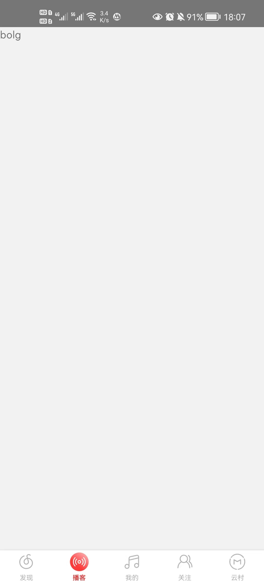
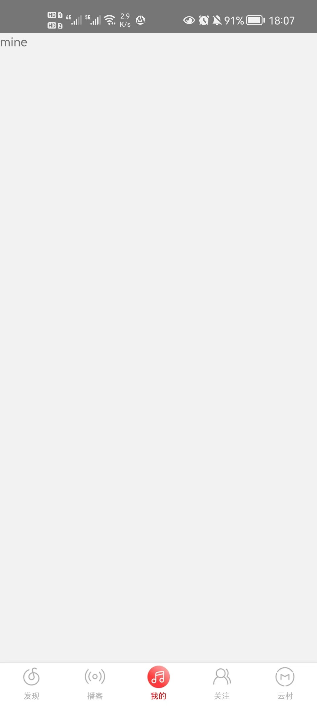
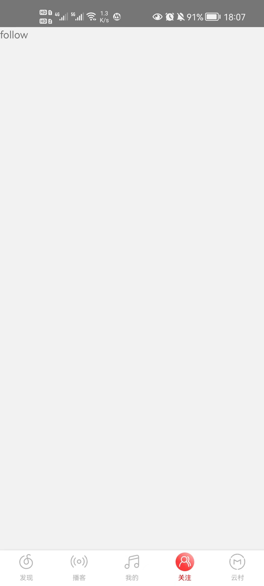
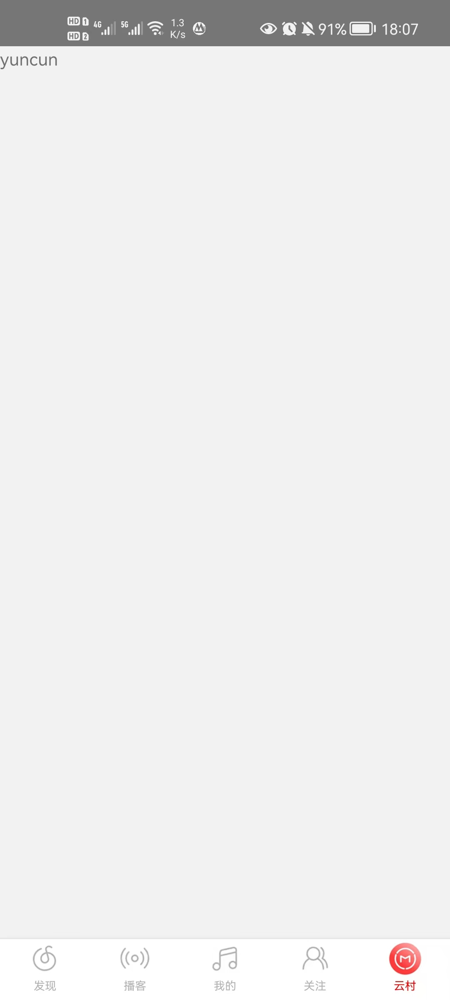

# 网易云音乐

**特别声明：本项目中的展示图片归网易云所有。如果侵权，请提交 Issues 联系。**

## 环境要求

需要 NodeJS 14.0.0+ 环境


需要 Java JDK 11+ 环境


需要 Android SDK 31+ 环境


## 简介

本项目是一个仿写网易云APP端项目。

后端接口部分使用 Binaryify 的 NodeJS 版 Api项目。

Api项目github地址: [https://github.com/Binaryify/NeteaseCloudMusicApi](https://github.com/Binaryify/NeteaseCloudMusicApi)。

Api接口文档地址: [https://binaryify.github.io/NeteaseCloudMusicApi/#/](https://binaryify.github.io/NeteaseCloudMusicApi/#/)。

## 项目使用技术栈

* React
* React Native 0.68.2
* Redux

## 插件介绍

状态管理
* redux
* redux-thunk
* react-redux

本地存储
* @react-native-async-storage/async-storage

路由
* @react-navigation/native
* @react-navigation/stack
* react-native-gesture-handler
* react-native-safe-area-context
* react-native-screens

tab导航
* @react-navigation/bottom-tabs

轮播图
* react-native-gesture-handler
* react-native-reanimated
* react-native-reanimated-carousel

渐变背景色
* react-native-linear-gradient

## 加入项目

如果想加入本项目开发，需将项目fork到自己的仓库下，功能开发完成后，提PR即可。

## 运行

启动项目

```
yarn install
```

```
yarn react-native start
```

```
yarn react-native run-android
```

## 查看项目效果

安卓手机教程: [https://blog.csdn.net/weixin_43233914/article/details/119568245](https://blog.csdn.net/weixin_43233914/article/details/119568245)。

### 项目效果图

|发现|播客|我的|关注|云村|
|---|---|---|---|---|
||||||

## 写在最后

* [The MIT License (MIT)](https://github.com/xlz122/react-native-music/blob/master/LICENSE)
* 本项目仅用于学习使用，切勿用于商业用途，否则产生的法律后果与作者无关。
